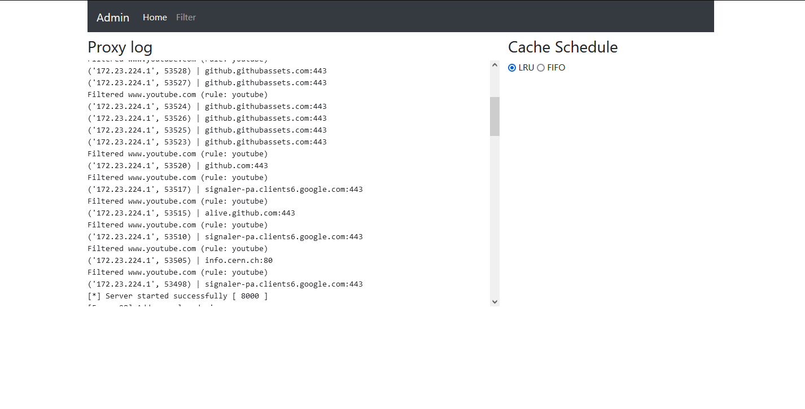
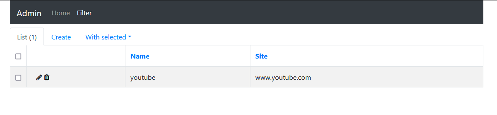

<h2 align=center>Proxy Server</h2>
<h4 style="opacity:70%;" align=center>Computer Networks Assignment</h4>

## Features
- HTTP communications between client and server
- HTTPs communications between client and server
- Caching of popular content using LRU or FIFO
- Content filtering configurable via admin console